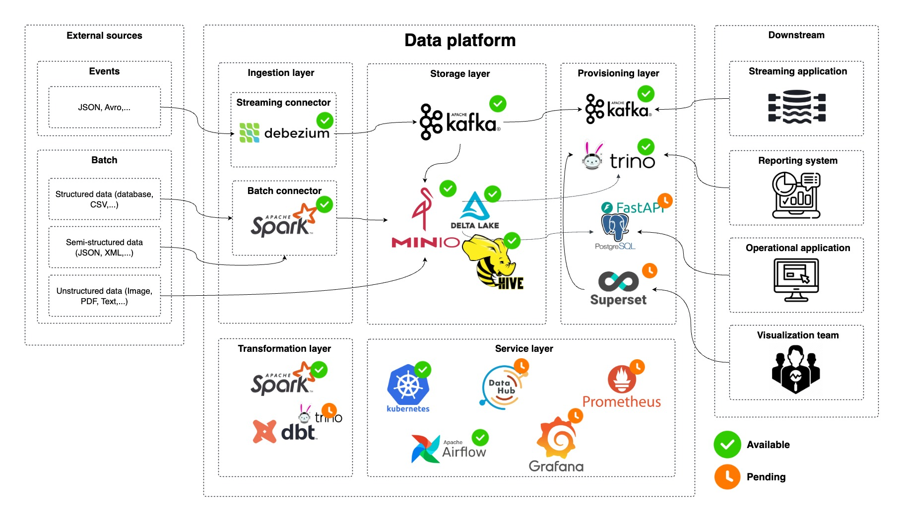

# Data Platform

## Table of Contents

* [Overview](#overview)
* [Architecture](#architecture)
* [Getting Started](#getting-started)
    * [Install MinIO](#install-minio)
    * [Install Spark Cluster](#install-spark-cluster)
    * [Install Airflow](#install-airflow)
    * [Install Hive Metastore](#install-hive-metastore)
    * [Install Kafka](#install-kafka)
    * [Install Sources](#install-sources)
    * [Install Kafka Connect](#install-kafka-connect)
* [License](#license)

## Overview

This platform leverages cloud-native technologies to build a flexible and efficient data pipeline. It supports various data ingestion, processing, and storage needs, enabling real-time and batch data analytics. The architecture is designed to handle structured, semi-structured, and unstructured data from diverse external sources.

## Architecture



The platform is organized into distinct layers:

* **Ingestion Layer:** Captures data from external sources using Debezium for streaming and Spark for batch.
* **Storage Layer:** Stores streaming data in Kafka and streaming/batch data in MinIO, there is a Hive metastore on top of the object storage with Delta Lake tables.
* **Transformation Layer:** Transforms and processes data using Spark, Trino, and dbt.
* **Provisioning Layer:** Expose data for multiple downstream applications through various connectors.
* **Service Layer:** Resource management, orchestration, data governance, and monitoring.

## Getting Started

```bash
# Create Kubernetes namespace
k create namespace data-platform
```

### Install MinIO

```bash
# Add repository
helm repo add minio-operator https://operator.min.io
helm search repo minio-operator
helm repo update

# Install client
brew install minio/stable/mc

# Download operator config
curl -sLo infra/services/minio/operator/values.yaml https://raw.githubusercontent.com/minio/operator/master/helm/operator/values.yaml

# Download tenant config
curl -sLo infra/services/minio/tenant/values.yaml https://raw.githubusercontent.com/minio/operator/master/helm/tenant/values.yaml
# Make sure you configure `externalCertSecret` and `requestAutoCert` so that the server use Self-signed certificate instead of auto-generated certificate

# Install server
make -f scripts/minio/Makefile generate-self-signed-cert
make -f scripts/minio/Makefile register-self-signed-cert
make -f scripts/minio/Makefile install

# Port forward for MinIO service and set up alias, & is to run it in background
k port-forward service/myminio-hl 9000 -n data-platform &
k port-forward service/myminio-console 9443 -n data-platform &

# Because we are using the Self-signed certificate, hence specify flag --insecure here
# Alias for Tenant service
mc alias set myminio https://localhost:9000 minio minio123 --insecure

# Create a bucket
mc mb myminio/mybucket --insecure
mc mb myminio/hive-warehouse --insecure
```

### Install Spark cluster

```bash
# Add repository
helm repo add spark-operator https://kubeflow.github.io/spark-operator
helm search repo spark-operator
helm repo update

# Download Spark config
curl -sLo infra/services/spark/values.yaml https://raw.githubusercontent.com/kubeflow/spark-operator/refs/heads/master/charts/spark-operator-chart/values.yaml

# Install Spark Operator and build Spark application base image
make -f scripts/spark/Makefile install
make -f scripts/spark/Makefile build-spark-application-dockerfile

# Running a Spark application to write file to MinIO with Delta Lake table format
make -f scripts/spark/Makefile build-spark-write-minio-dockerfile
k apply -f pipeline/spark-write-minio/job.yaml

# Release Docker images
make -f scripts/spark/Makefile release-docker-images

# Go to https://localhost:9443/browser/mybucket/user_data to view data files
```

### Install Airflow

```bash
helm repo add apache-airflow https://airflow.apache.org
helm search repo apache-airflow
helm repo update

# Download Airflow config
curl -sLo infra/services/airflow/operator/values.yaml https://raw.githubusercontent.com/apache/airflow/refs/heads/main/chart/values.yaml

# Install Airflow Operator
make -f scripts/airflow/Makefile build-custom-dockerfile
make -f scripts/airflow/Makefile release-docker-images
make -f scripts/airflow/Makefile install

# Port forward for Airflow webserver
k port-forward service/airflow-operator-webserver 8080 -n data-platform &
```

### Install Hive metastore

```bash
# Download Postgres config
curl -sLo infra/services/hive/database/values.yaml https://raw.githubusercontent.com/bitnami/charts/refs/heads/main/bitnami/postgresql/values.yaml

# Install Hive metastore
make -f scripts/hive/Makefile build-metastore-custom-dockerfile
make -f scripts/hive/Makefile build-schematool-custom-dockerfile
make -f scripts/hive/Makefile release-docker-images
make -f scripts/hive/Makefile install

# Port forward for Hive metastore database and thrift
k port-forward service/hive-metastore-postgres-postgresql 5432 -n data-platform &
k port-forward service/hive-metastore 9083 -n data-platform &

# export HADOOP_ROOT_LOGGER=DEBUG,console && hadoop fs -ls s3a://hive-warehouse/
# hadoop org.apache.hadoop.conf.Configuration
# hdfs getconf -confKey [key]

# Create a Hive table to test Hive metastore
make -f scripts/spark/Makefile build-spark-create-hive-table-dockerfile
k apply -f pipeline/spark-create-hive-table/job.yaml
```

### Install Kafka

```bash
# Download Kafka config
curl -sLo infra/services/kafka/operator/values.yaml https://raw.githubusercontent.com/bitnami/charts/refs/heads/main/bitnami/kafka/values.yaml

# Install Kafka
make -f scripts/kafka/Makefile generate-self-signed-cert-keystore-truststore
make -f scripts/kafka/Makefile register-self-signed-cert-keystore-truststore
make -f scripts/kafka/Makefile install

# Port forward for Kafka service
k port-forward service/kafka-operator 9092 -n data-platform &

# Create a client pod for accessing Kafka cluster data
make -f scripts/kafka/Makefile create-kafka-client-pod
kafka-console-producer.sh \
    --producer.config /tmp/client.properties \
    --bootstrap-server kafka-operator.data-platform.svc.cluster.local:9092 \
    --topic test

# Consume those messages
kafka-console-consumer.sh \
    --consumer.config /tmp/client.properties \
    --bootstrap-server kafka-operator.data-platform.svc.cluster.local:9092 \
    --topic test \
    --from-beginning

# List Kafka topics
kafka-topics.sh \
    --command-config /tmp/client.properties \
    --bootstrap-server kafka-operator.data-platform.svc.cluster.local:9092 \
    --list
```

### Install sources

This is the installation of source systems with databases so that we can integrate the CDC from these to our datalake with Kafka Connector

```bash
# Install Postgres source
make -f scripts/sources/Makefile install-postgres

# Port forward for Postgres source
k port-forward service/postgres-source-postgresql 5432 -n data-platform &
```

### Install Kafka Connect

```bash
make -f scripts/kafka-connect/Makefile install

# Port forward for Kafka Connect REST endpoint
k port-forward service/kafka-connect-operator-cp-kafka-connect 8083 -n data-platform &

# List all installed plugins
curl -sS localhost:8083/connector-plugins

# Create Postgres connector
make -f scripts/kafka-connect/Makefile create-postgres-connector
make -f scripts/kafka-connect/Makefile get-all-connectors
```

## License

This project is licensed under the [Apache License](LICENSE).